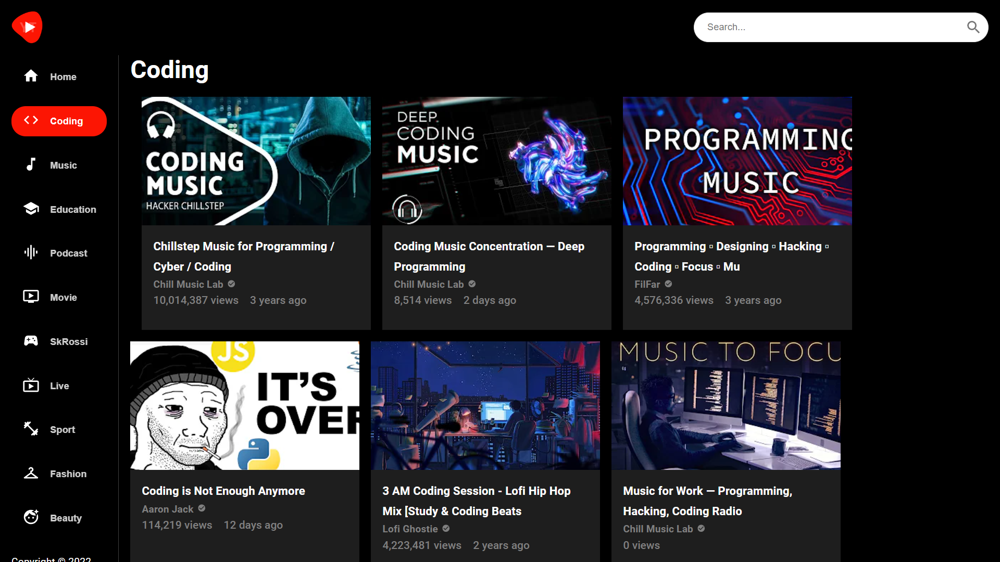

# YouTube Clone 

##### Live Website

## Introduction

This project is a YouTube clone built using React for the frontend and Rapid API to access and manage data. It provides users with the ability to view and upload videos, comment, like, and subscribe to channels.

